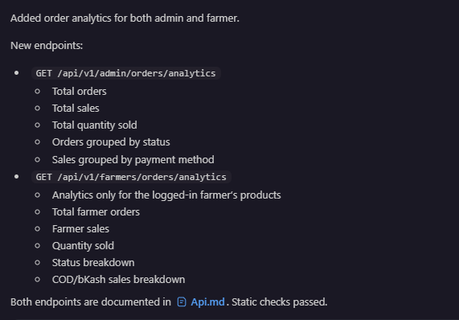

 # KrishiBazar API

 <!-- Run commend -->
<!-- (.\mvnw.cmd spring-boot:run) -->

## Local API URL

When running the backend locally, use:

```text
http://localhost:8080
```

Example:

```text
POST http://localhost:8080/api/v1/auth/login
```

All API responses use this format:

```json
{
	"success": true,
	"statusCode": 200,
	"message": "Message for the client",
	"data": {}
}
```

## Marketplace search

### List, search, and filter products

```text
GET /api/v1/products?q=rice&categoryId={uuid}&farmerId={uuid}&minPrice=10&maxPrice=500
```

All query parameters are optional. `q` searches product name and description;
`categoryId`, `farmerId`, `minPrice`, and `maxPrice` filter the result. The
response data is a product array.

## Admin management

The following endpoints require an admin JWT:

```text
GET    /api/v1/admin/users
PATCH  /api/v1/admin/users/{userId}/deactivate
PATCH  /api/v1/admin/users/{userId}/activate
GET    /api/v1/admin/products
PUT    /api/v1/admin/products/{productId}
DELETE /api/v1/admin/products/{productId}
GET    /api/v1/admin/dashboard/stats
```

The activate/deactivate endpoints return a `UserResponse`. Admin product update
uses the same `ProductRequest` body as `PUT /api/v1/products/{productId}` and
can manage products belonging to any farmer. Dashboard `data` contains:

```json
{
  "totalUsers": 10,
  "activeUsers": 9,
  "totalFarmers": 4,
  "totalProducts": 25,
  "totalOrders": 18,
  "totalReviews": 12,
  "openReports": 2,
  "totalSales": 12500.00
}
```

## Ratings and reviews

Reviews are public to read and require a logged-in user to create, update, or
delete. A user can submit one review per product. `rating` must be from 1 to 5.

```text
GET    /api/v1/products/{productId}/reviews
POST   /api/v1/products/{productId}/reviews
PUT    /api/v1/reviews/{reviewId}
DELETE /api/v1/reviews/{reviewId}
```

Create/update body:

```json
{
  "rating": 5,
  "comment": "Fresh and delivered on time"
}
```

## Reports

Any authenticated user can submit a report. Listing and changing report status
require an admin JWT.

```text
POST  /api/v1/reports
GET   /api/v1/reports
PATCH /api/v1/reports/{reportId}
```

Submit body:

```json
{
  "targetType": "PRODUCT",
  "targetId": "550e8400-e29b-41d4-a716-446655440000",
  "reason": "Misleading listing",
  "description": "The product description does not match the item."
}
```

Admin status body accepts `OPEN`, `IN_REVIEW`, `RESOLVED`, or `REJECTED`:

```json
{ "status": "IN_REVIEW" }
```

Protected endpoints require an `Authorization: Bearer <token>` header. If the
header is missing or the token is invalid, the API returns `401 Unauthorized`
using the same response format with the message
`Authorization is required to access this endpoint`.

## Authorization header

Login returns a JWT access token. Send that token on every protected API:

```text
Authorization: Bearer <token-from-login-response>
```

For local testing, make one registered user an admin directly in the database:

```sql
UPDATE users SET role = 'ADMIN' WHERE email = 'admin@example.com';
```

## Authentication

### Register

```text
POST /api/v1/auth/register
```

```json
{
	"name": "Pronoy",
	"email": "pronoy@example.com",
	"password": "12345678"
}
```

### Login

```text
POST /api/v1/auth/login
```

```json
{
	"email": "pronoy@example.com",
	"password": "12345678"
}
```

The login response contains the user's id, role, and JWT token. The token payload includes:

```json
{
	"sub": "user-uuid",
	"role": "USER",
	"iat": 1760000000,
	"exp": 1760086400
}
```

Copy the `data.token` value from the login response and send it in the
`Authorization` header. Opening the protected URL directly in a browser will
return `401` because the browser request has no JWT header.

## Farmer application and profile

## Admin creation

This endpoint does not require an authentication header.

```text
POST /api/v1/admin/users
```

```json
{
	"name": "New Admin",
	"email": "newadmin@example.com",
	"password": "12345678"
}
```

### 1. User applies to become a farmer

The user sends this request with the bearer token from login. The application starts with `PENDING` status.

```text
POST /api/v1/farmers/application
Authorization: Bearer <token>
```

Example with `curl`:

```bash
curl -X POST http://localhost:8080/api/v1/farmers/application \
	-H "Authorization: Bearer <token-from-login-response>" \
	-H "Content-Type: application/json" \
	-d '{
		"farmName": "Green Valley Farm",
		"address": {
			"district": "Rangpur",
			"zilla": "Rangpur",
			"detailsAddress": "Village Road, Mithapukur"
		},
		"phoneNumber": "01700000000",
		"description": "Vegetable and rice farm",
		"nidCard": {
			"frontImage": "https://example.com/nid-front.jpg",
			"backImage": "https://example.com/nid-back.jpg"
		}
	}'
```

```json
{
	"farmName": "Green Valley Farm",
	"address": {
		"district": "Rangpur",
		"zilla": "Rangpur",
		"detailsAddress": "Village Road, Mithapukur"
	},
	"phoneNumber": "01700000000",
	"description": "Vegetable and rice farm",
	"nidCard": {
		"frontImage": "https://example.com/nid-front.jpg",
		"backImage": "https://example.com/nid-back.jpg"
	}
}
```

### Check application status

```text
GET /api/v1/farmers/application
Authorization: Bearer <token>
```

### 2. Admin views applications

The header must belong to a user whose database role is `ADMIN`.

```text
GET /api/v1/admin/farmer-applications
Authorization: Bearer <admin-token>
```

### Admin approves an application

Approval changes the user's role from `USER` to `FARMER` and creates the farmer profile.

```text
POST /api/v1/admin/farmer-applications/{applicationId}/approve
Authorization: Bearer <admin-token>
```

### Admin rejects an application

```text
POST /api/v1/admin/farmer-applications/{applicationId}/reject
Authorization: Bearer <admin-token>
```

### Get farmer profile

Any authenticated user can use this endpoint. For users without a farmer
profile, farmer-specific fields are returned as `null`. The `role` field
contains the current user's role: `USER`, `FARMER`, or `ADMIN`.

```text
GET /api/v1/farmers/profile
Authorization: Bearer <token>
```

Example response for a user without a farmer profile:

```json
{
	"success": true,
	"statusCode": 200,
	"message": "User profile fetched successfully",
	"data": {
		"id": null,
		"userId": "dc1782f7-5046-441b-b44b-5b467b7fd023",
		"farmerName": "Pronoy",
		"email": "pronoy@example.com",
		"role": "USER",
		"farmName": null,
		"address": null,
		"phoneNumber": null,
		"description": null,
		"createdAt": "2026-09-21T12:00:00",
		"updatedAt": "2026-09-21T12:00:00"
	}
}
```

### Update farmer profile and farm information

```text
PUT /api/v1/farmers/profile
Authorization: Bearer <farmer-token>
```

```json
{
	"farmName": "Updated Green Valley Farm",
	"address": {
		"district": "Rangpur",
		"zilla": "Rangpur",
		"detailsAddress": "New Village Road, Mithapukur"
	},
	"phoneNumber": "01700000000",
	"description": "Organic vegetables and rice"
}
```

## Categories

Category reads are public. A category with `parentCategoryId: null` is a top-level category. Set `parentCategoryId` to a top-level category ID to create a subcategory.

### Get all categories

```text
GET /api/v1/categories
```

This returns top-level categories with their subcategories nested in `children`.
Each child contains `id`, `name`, `parentCategoryId`, `createdAt`, and
`updatedAt`.

### Get all subcategories for a parent category

Use the top-level category ID as `parentCategoryId`. This endpoint is public
and returns an empty `data` array when the parent category has no subcategories.

```text
GET /api/v1/categories/{parentCategoryId}/subcategories
```

Example:

```text
GET /api/v1/categories/aaaa99c0-ec8b-4e93-aa88-9491804220b4/subcategories
```

### Get one category

```text
GET /api/v1/categories/{categoryId}
```

### Create a category or subcategory

Only an `ADMIN` can create categories.

```text
POST /api/v1/categories
Authorization: Bearer <admin-token>
```

```json
{
	"name": "Vegetables",
	"parentCategoryId": null
}
```

For a subcategory, replace `parentCategoryId` with the ID of a top-level category.

### Update a category

```text
PUT /api/v1/categories/{categoryId}
Authorization: Bearer <admin-token>
```

Use the same JSON body as the create request.

### Delete a category

A category cannot be deleted while it has subcategories or products assigned to it.

```text
DELETE /api/v1/categories/{categoryId}
Authorization: Bearer <admin-token>
```

## Blogs

Blog read APIs are public. Creating, updating, and deleting blogs require an
`ADMIN` bearer token.

### Get all blogs

```text
GET /api/v1/blogs
```

### Get one blog

```text
GET /api/v1/blogs/{blogId}
```

### Create a blog

```text
POST /api/v1/blogs
Authorization: Bearer <admin-token>
Content-Type: application/json
```

```json
{
  "title": "How to grow healthy tomatoes",
  "content": "Use healthy soil, adequate sunlight, and regular watering.",
  "imageUrl": "https://example.com/tomato-blog.jpg"
}
```

### Update a blog

```text
PUT /api/v1/blogs/{blogId}
Authorization: Bearer <admin-token>
Content-Type: application/json
```

The request body is the same as the create request.

### Delete a blog

```text
DELETE /api/v1/blogs/{blogId}
Authorization: Bearer <admin-token>
```

## Products

### Get all products

This endpoint is public and returns products newest first.

```text
GET /api/v1/products
```

### Get all products for a farmer

This endpoint is public and returns the specified farmer's products newest first.

```text
GET /api/v1/products/farmer/{farmerId}
```

### 3. Approved farmer adds a product

Only a user with role `FARMER` can add products.

```text
POST /api/v1/products
Authorization: Bearer <farmer-token>
```

```json
{
	"name": "Tomato",
	"description": "Fresh farm tomatoes",
	"price": 80.00,
	"quantity": 50,
	"unit": "kg",
	"imageUrl": "https://example.com/tomato.jpg",
	"categoryId": "550e8400-e29b-41d4-a716-446655440000"
}
```

Use the actual `id` returned by `GET /api/v1/categories`. Numeric values such as
`"1232"` are not valid because category IDs are UUIDs.

### Update a product

Only the farmer who owns the product can update it.

```text
PUT /api/v1/products/{productId}
Authorization: Bearer <farmer-token>
```

```json
{
	"name": "Updated Tomato",
	"description": "Fresh red farm tomatoes",
	"price": 90.00,
	"quantity": 40,
	"unit": "kg",
	"imageUrl": "https://example.com/updated-tomato.jpg",
	"categoryId": "550e8400-e29b-41d4-a716-446655440000"
}
```

The authenticated farmer must own the product. Use the actual `categoryId`
returned by `GET /api/v1/categories`.

### Delete a product

Only the owner can delete the product.

```text
DELETE /api/v1/products/{productId}
Authorization: Bearer <farmer-token>
```

## Existing users endpoint

```text
GET /api/v1/users
```

## Shopping, checkout, and orders

### Get product details

Public endpoint:

```text
GET /api/v1/products/{productId}
```

Example:

```text
GET http://localhost:8080/api/v1/products/750e8400-e29b-41d4-a716-446655440000
```

The response contains one product with category information and `farmer`,
which contains the farmer's public profile information. Sensitive NID images
are not included in this public response.

```json
{
  "success": true,
  "statusCode": 200,
  "message": "Product fetched successfully",
  "data": {
    "id": "750e8400-e29b-41d4-a716-446655440000",
    "farmerId": "850e8400-e29b-41d4-a716-446655440000",
    "farmerName": "Rahim Uddin",
    "farmer": {
      "id": "850e8400-e29b-41d4-a716-446655440000",
      "name": "Rahim Uddin",
      "email": "rahim@example.com",
      "farmName": "Green Valley Farm",
      "address": {
        "district": "Rangpur",
        "zilla": "Rangpur",
        "detailsAddress": "Village Road, Mithapukur"
      },
      "phoneNumber": "01700000000",
      "description": "Organic vegetables and rice farm"
    },
    "categoryId": "550e8400-e29b-41d4-a716-446655440000",
    "categoryName": "Vegetables",
    "parentCategoryId": null,
    "name": "Tomato",
    "description": "Fresh farm tomatoes",
    "price": 80.00,
    "quantity": 50,
    "unit": "kg",
    "imageUrl": "https://example.com/tomato.jpg",
    "createdAt": "2026-09-24T23:55:00",
    "updatedAt": "2026-09-24T23:55:00"
  }
}
```

If the product ID does not exist, the API returns `Product not found`.

### Cart

Add quantity to the authenticated user's cart. If the product is already in
the cart, the quantity is increased.

```text
POST /api/v1/cart/items
Authorization: Bearer <token>
```

```json
{
  "productId": "550e8400-e29b-41d4-a716-446655440000",
  "quantity": 2
}
```

```text
GET /api/v1/cart
DELETE /api/v1/cart/items/{itemId}
Authorization: Bearer <token>
```

### Delivery addresses

Addresses belong to the authenticated user and can be reused at checkout.

```text
POST /api/v1/addresses
GET /api/v1/addresses
PUT /api/v1/addresses/{addressId}
DELETE /api/v1/addresses/{addressId}
Authorization: Bearer <token>
```

The POST and PUT body is:

```json
{
  "userName": "Rahim Uddin",
  "mobileNumber": "01700000000",
  "district": "Rangpur",
  "zilla": "Rangpur",
  "detailsAddress": "Village Road, Mithapukur"
}
```

### Confirm an order and choose payment method

The checkout endpoint creates an order from the complete cart, checks stock,
decreases product stock, and clears the cart. Supported payment methods are
`COD` and `BKASH`. This API records the selection; a separate bKash gateway
integration can be connected later. `paymentReference` is optional and can be
used for a bKash transaction ID.

```text
POST /api/v1/orders/confirm
Authorization: Bearer <token>
```

```json
{
  "addressId": "650e8400-e29b-41d4-a716-446655440000",
  "paymentMethod": "COD",
  "paymentReference": null,
  "items": [
    {
      "productId": "750e8400-e29b-41d4-a716-446655440000",
      "quantity": 2
    }
  ]
}
```

For bKash, send `"paymentMethod": "BKASH"`.

### Customer order information

```text
GET /api/v1/orders
GET /api/v1/orders/{orderId}
Authorization: Bearer <token>
```

### Admin order management

Only an `ADMIN` can see all orders or change an order status.

```text
GET /api/v1/admin/orders
PATCH /api/v1/admin/orders/{orderId}/status
Authorization: Bearer <admin-token>
```

Status body:

```json
{
  "status": "PROCESSING"
}
```

Allowed statuses are `PENDING`, `PICKUP`, `PROCESSING`, `SHIPPED`, `DELIVERED`,
and `CANCELLED`. New orders start as `PENDING`.

### Farmer order information

An approved farmer can see orders containing their own products, including safe
farmer profile details on each order item. Farmers can mark their own orders as
`PICKUP`; admins can move orders through all statuses.

```text
GET /api/v1/farmers/orders
PATCH /api/v1/farmers/orders/{orderId}/status
GET /api/v1/farmers/orders/dashboard
Authorization: Bearer <farmer-token>
```

Farmer pickup status body: `{ "status": "PICKUP" }`.

### Admin order analytics

Returns total orders, total sales, total quantity sold, order counts grouped
by status, sales grouped by payment method, delivered sales, and delivered
order count. Only an `ADMIN` can access it.

```text
GET /api/v1/admin/orders/analytics
Authorization: Bearer <admin-token>
```

### Farmer order analytics

Returns analytics only for products owned by the authenticated farmer. A farmer
cannot see another farmer's sales or change any order status.

```text
GET /api/v1/farmers/orders/analytics
Authorization: Bearer <farmer-token>
```



